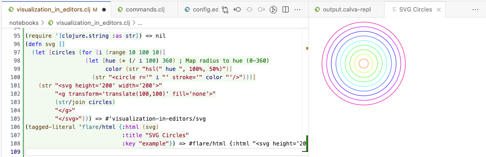

# Flares

Flares are special values that request Calva behavior like showing HTML in a WebView panel.
Flares are used by tools like [Clay](https://scicloj.github.io/clay/) to show data visualizations.
You can make Custom REPL Commands that produce flares.
Calva inspects all REPL evaluation for flares, so you can use them in the REPL too.
Flares can be used with any type of REPL, including: Clojure, ClojureScript, Babashka, Joyride.

## Try Flares in the REPL

Try this example by copying it to your Calva REPL:

```clojure
(tagged-literal 'flare/html {:html "<h1>Hello, Flares!</h1>",
                             :title "Greeting"
                             :key "example"})
```

A WebView panel opens up showing the rendered HTML content.

Flares are [tagged literals](https://clojure.org/reference/reader#tagged_literals) consisting of a tag indicating the desired action, and a map containing the request details.
The `tagged-literal` function is a clojure.core function that creates the special value.
Clojure prints tagged literals as `#tag{...}`, so when you create the flare, it will be printed as `#flare/html{...}`.

- **Tag**: `flare/html` – Indicates a WebView request
- **Request**: `{:html "..."}` - HTML content to display

To show a webpage, pass a `:url` instead of `:html` in the request:

```clojure
(tagged-literal 'flare/html {:url "https://calva.io/",
                             :title "Calva homepage"
                             :key "example"})
```

The `:key` parameter is optional and can be used to reuse the same WebView panel.
If omitted, a new WebView panel will be created per request.

## Try a more interesting example

Let's create an SVG containing circles of varying radii and colors:

```clojure
(require '[clojure.string :as str])
(defn svg []
  (let [circles (for [i (range 10 100 10)]
                  (let [hue (* (/ i 100) 360) ; Map radius to hue (0-360)
                        color (str "hsl(" hue ", 100%, 50%)")]
                    (str "<circle r='" i "' stroke='" color "'/>")))]
    (str "<svg height='200' width='200'>"
         "<g transform='translate(100,100)' fill='none'>"
         (str/join circles)
         "</g>"
         "</svg>")))
(tagged-literal 'flare/html {:html (svg)
                             :title "SVG Circles"
                             :key "example"})
```

Copy this code into your Calva REPL and evaluate it to see the SVG image.
The WebView panel will display the SVG content.



You can iterate quickly, modifying code and using the flare to see the result.
To make it more convenient, you might use a custom action instead.
Flares are useful for creating your own visualization shortcuts,
and tools can also use Flares to show information in the IDE.

Use [Hiccup](https://github.com/weavejester/hiccup) to generate HTML or SVG.
This example uses string concatenation to avoid setting up the dependency.

## Data Visualization

The WebView panel is perfect for charts, tables and other data visualizations.

[Clay](https://scicloj.github.io/clay/) shows visualizations in a WebView panel by using Flares.
[Clay visualization examples](https://scicloj.github.io/clay/clay_book.examples.html)
[Clay in Calva setup](https://scicloj.github.io/clay/#vscode-calva)

## What can the WebView panel do?

The [WebView panel](https://code.visualstudio.com/api/extension-guides/webview) is a full browser,
so you can do anything you can do in a browser, there's really no limit.

## Flare Reference

### `flare/html`

| Key | Type | Default | Description |
|--- |--- |--- |--- |
| `:title` | string | "WebView" | Shown in the panel title. |
| `:html` | string | nil | HTML to show in a WebView. |
| `:url` | string | nil | Show the page hosted at URL in a WebView. |
| `:key` | string | nil | An identifier for the panel. The request will reuse an open WebView if it exists already. |
| `:reload` | boolean | false | If true, sets the content even if it didn't change. |
| `:reveal` | boolean | true | If true, reveals the panel if it is not visible. |
| `:column` | integer | vscode.ViewColumn.Beside | See [ViewColumn](https://code.visualstudio.com/api/references/vscode-api#ViewColumn) |
| `:opts` | map | {:enableScripts true} | See [WebviewOptions](https://code.visualstudio.com/api/references/vscode-api#WebviewOptions) |

### Suggestions welcome

If there are other use cases for Flares, please let us know.
